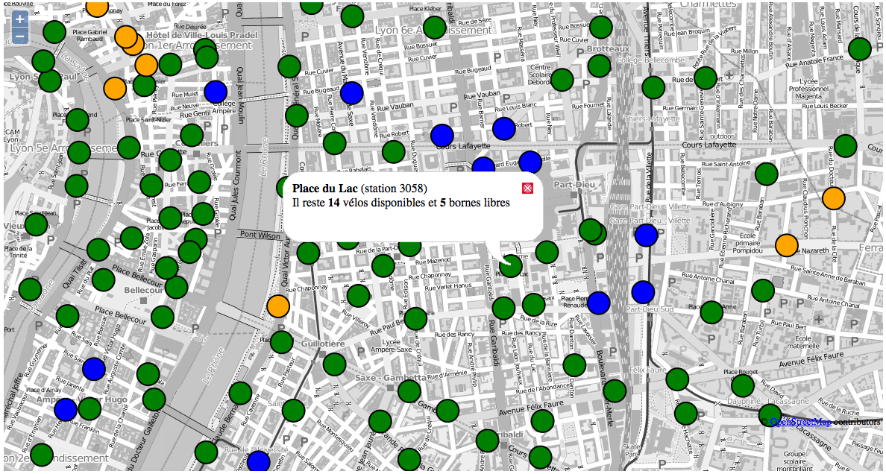
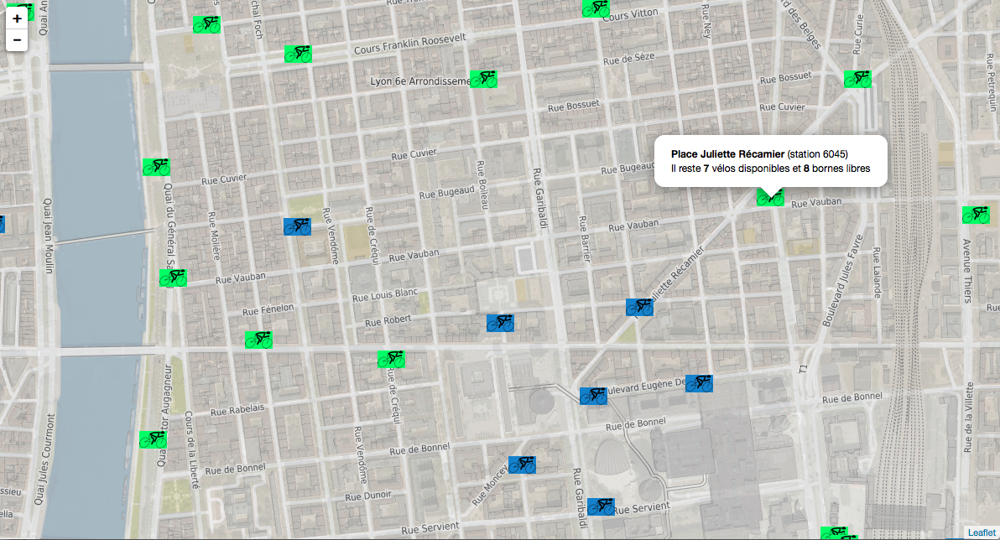
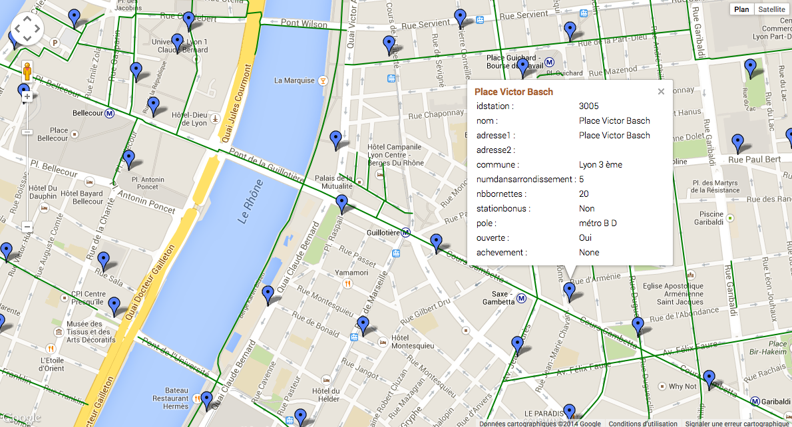

.. _exemples:

Exemples et extraits de code
==============================

WMS avec OpenLayers
-------------------
Cet exemple montre l'utilisation du service WFS avec les bornes vélo'v en temps réel à travers la bibliothèque OpenLayers.

Code source correspondant :

.. code-block:: html

    <html>
      <head>
        <title>Utilisation des services GrandLyon Data : OpenLayers</title>
        
      </head>
        <body>
          

          
        </body>
    </html>

WFS avec Leaflet
----------------
Cet exemple montre l'utilisation du service WFS avec les bornes vélo'v en temps réel à travers la bibliothèque LeafLet.

Code source correspondant :

.. code-block:: html

    <html>
      <head>
        <title>Utilisation des services GrandLyon Data : Leaflet</title>
        <meta charset="utf-8" />

        <meta name="viewport" content="width=device-width, initial-scale=1.0">
                
        
        
        
        <link rel="stylesheet" href="leaflet.css" />
        
      </head>
      <body>
        

        
        </body>
    </html>

KML avec l'API Maps de Google
------------------------------------

Cet exemple montre l'utilisation du service KML avec les bornes vélo'v à travers l'API Google Maps v3. Nécessite une clé pour l'API.

Code source correspondant :

.. code-block:: html
   
    <html>
      <head>
        <title>Utilisation des services GrandLyon Data : Google API</title>
        <meta name="viewport" content="initial-scale=1.0, user-scalable=no" />
        
        
    
        
        
      </head>
      <body>
        

      </body>
    </html>
    
    
Utilisation du WCS
-------------------
Cet exemple montre l'utilisation du service WCS pour obtenir une ortophoto sur une zone de travail.

**Phase 1** : lecture des capacités du service

https://download.data.grandlyon.com/wcs/grandlyon?SERVICE=WCS&REQUEST=GetCapabilities&VERSION=1.0.0

.. code-block:: xml

	<WCS_Capabilities xmlns="http://www.opengis.net/wcs" xmlns:xlink="http://www.w3.org/1999/xlink" xmlns:gml="http://www.opengis.net/gml" xmlns:xsi="http://www.w3.org/2001/XMLSchema-instance" version="1.0.0" updateSequence="0" xsi:schemaLocation="http://www.opengis.net/wcs http://schemas.opengis.net/wcs/1.0.0/wcsCapabilities.xsd">
		<Service>
			<description>
			Base de la plateforme d'intégration de données géographiques du Grand Lyon. Données sous Licence Ouverte (Etalab).
			</description>
			<name>MapServer WCS</name>
			<label>Serveur WCS du GrandLyon</label>
			<responsibleParty>
				<individualName>Diffusion de données et géoservices</individualName>
				<organisationName>
				Grand Lyon - Direction des systèmes d'informations et de télécommunications
				</organisationName>
				<positionName>owner</positionName>
				<contactInfo>
				<address>
					<deliveryPoint>20, rue du Lac - BP 31 03</deliveryPoint>
					<city>Lyon cedex 03</city>
					<administrativeArea>Rhône-Alpes</administrativeArea>
					<postalCode>69399</postalCode>
					<country>France</country>
					<electronicMailAddress>smartdata@grandlyon.org</electronicMailAddress>
				</address>
				<onlineResource xlink:type="simple" xlink:href="https://download.data.grandlyon.com/wcs/grandlyon"/>
				</contactInfo>
			</responsibleParty>
			<fees>no conditions apply</fees>
			<accessConstraints>None</accessConstraints>
		</Service>
		<Capability>...</Capability>
		<ContentMetadata>
			<CoverageOfferingBrief>
				<name>Ortho2009_vue_ensemble_16cm_CC46</name>
				<lonLatEnvelope srsName="urn:ogc:def:crs:OGC:1.3:CRS84">
					<gml:pos>4.66488945660669 45.5384488998787</gml:pos>
					<gml:pos>5.17955354166403 45.9426997122181</gml:pos>
				</lonLatEnvelope>
			</CoverageOfferingBrief>
			<CoverageOfferingBrief>
				<name>1830_5155_16_CC46</name>
				<lonLatEnvelope srsName="urn:ogc:def:crs:OGC:1.3:CRS84">
					<gml:pos>4.66596079716618 45.5819080900619</gml:pos>
					<gml:pos>4.73140908341002 45.6278468986858</gml:pos>
				</lonLatEnvelope>
			</CoverageOfferingBrief>
			<CoverageOfferingBrief>...</CoverageOfferingBrief>
		</ContentMetadata>
	</WCS_Capabilities>
	
**Phase 2** : détail d'une coverage 

https://download.data.grandlyon.com/wcs/grandlyon?SERVICE=WCS&REQUEST=DescribeCoverage&VERSION=1.0.0&COVERAGE=1830_5155_16_CC46

.. code-block:: xml

	<CoverageDescription xmlns="http://www.opengis.net/wcs" xmlns:xlink="http://www.w3.org/1999/xlink" xmlns:gml="http://www.opengis.net/gml" xmlns:xsi="http://www.w3.org/2001/XMLSchema-instance" version="1.0.0" updateSequence="0" xsi:schemaLocation="http://www.opengis.net/wcs http://schemas.opengis.net/wcs/1.0.0/describeCoverage.xsd">
		<CoverageOffering>
			<name>1830_5155_16_CC46</name>
			<lonLatEnvelope srsName="urn:ogc:def:crs:OGC:1.3:CRS84">
				<gml:pos>4.66596079716618 45.5819080900619</gml:pos>
				<gml:pos>4.73140908341002 45.6278468986858</gml:pos>
			</lonLatEnvelope>
			<domainSet>
				<spatialDomain>
					<gml:Envelope srsName="EPSG:4326">
						<gml:pos>4.66596079716618 45.5819080900619</gml:pos>
						<gml:pos>4.73140908341002 45.6278468986858</gml:pos>
					</gml:Envelope>
					<gml:Envelope srsName="EPSG:3946">
						<gml:pos>1830000 5155000</gml:pos>
						<gml:pos>1835000 5160000</gml:pos>
					</gml:Envelope>
					<gml:RectifiedGrid dimension="2">
						<gml:limits>
							<gml:GridEnvelope>
								<gml:low>0 0</gml:low>
								<gml:high>31249 31249</gml:high>
							</gml:GridEnvelope>
						</gml:limits>
						<gml:axisName>x</gml:axisName>
						<gml:axisName>y</gml:axisName>
						<gml:origin>
							<gml:pos>1830000 5160000</gml:pos>
						</gml:origin>
						<gml:offsetVector>0.16 0</gml:offsetVector>
						<gml:offsetVector>0 -0.16</gml:offsetVector>
					</gml:RectifiedGrid>
				</spatialDomain>
			</domainSet>
			<supportedCRSs>
				<requestResponseCRSs>EPSG:3946</requestResponseCRSs>
				<nativeCRSs>EPSG:3946</nativeCRSs>
			</supportedCRSs>
			<supportedFormats>
				<formats>GTiff</formats>
			</supportedFormats>
			<supportedInterpolations default="nearest neighbor">
				<interpolationMethod>nearest neighbor</interpolationMethod>
				<interpolationMethod>bilinear</interpolationMethod>
			</supportedInterpolations>
		</CoverageOffering>
	</CoverageDescription>

**Phase 3** : obtention de l'image sur une zone

https://download.data.grandlyon.com/wcs/grandlyon?SERVICE=WCS&VERSION=1.0.0&REQUEST=GetCoverage&FORMAT=GTiff&COVERAGE=1830_5155_16_CC46&BBOX=1832784,5156714.08000000007450581,1834141.43999999994412065,5158023.36000000033527613&CRS=EPSG:3946&RESPONSE_CRS=EPSG:3946&WIDTH=849&HEIGHT=819

.. image:: _static/wcs.png
